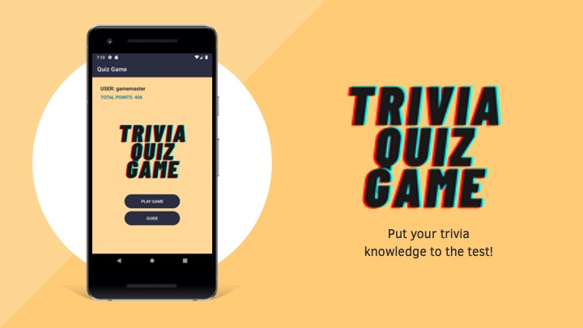
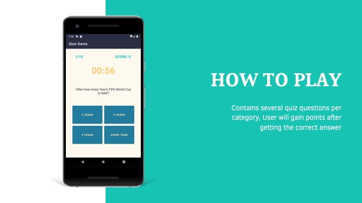
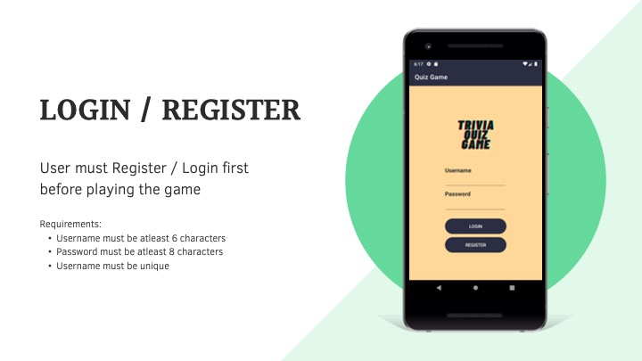
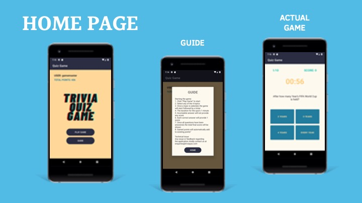
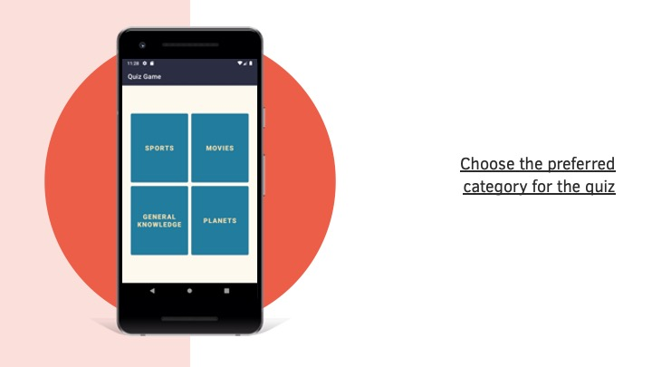
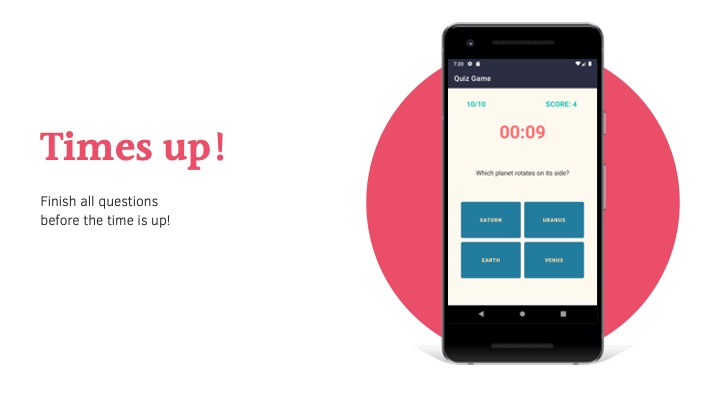
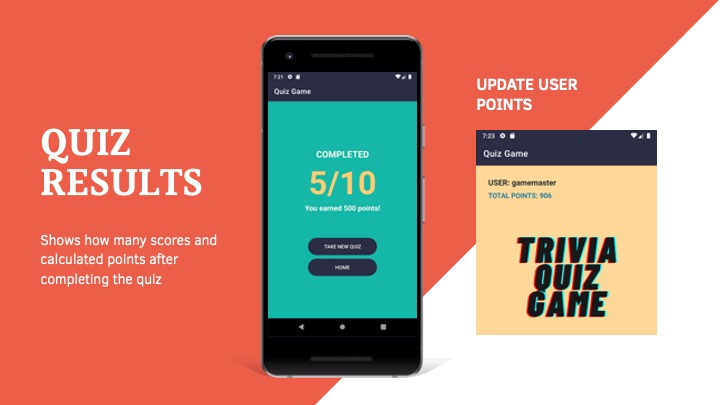
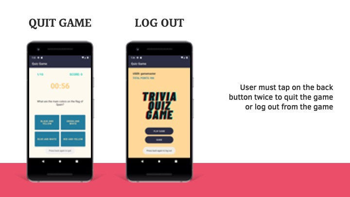

# quiz-game-android-app

A Trivia Quiz Game mobile application is a quiz base game that will make learning interesting for everyone. It allows users to register to the game so the user’s information will be saved at the end of the quiz with the points being achieved. It is an application that consist of 4 sets of questions pertaining to a specific topic. Points will be awarded to the user who guessed the correct answer. The actual answer of the quiz will be shown once the answer has been submitted. 
- Implemented through the use of mulitple fragments and activites.
- Database implemented using SQLite.
- Has automated UI Tests.

# App Preview

  
  
  
  
  
  
  
  
  

 

# [Download PDF here](https://github.com/bjazmin/quiz-game-android-app/files/7733266/TriviaQuiz.Game.pdf)

